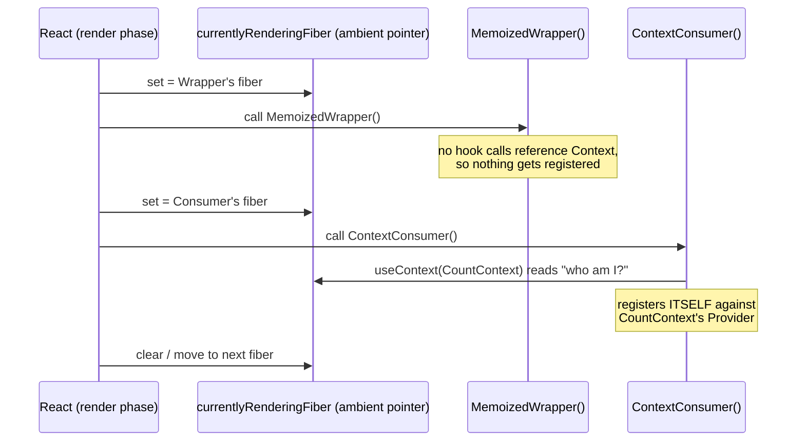
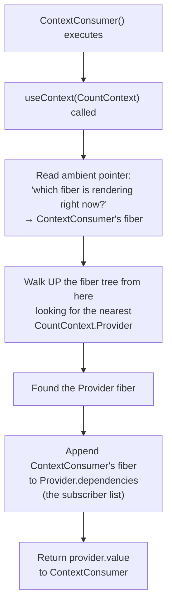
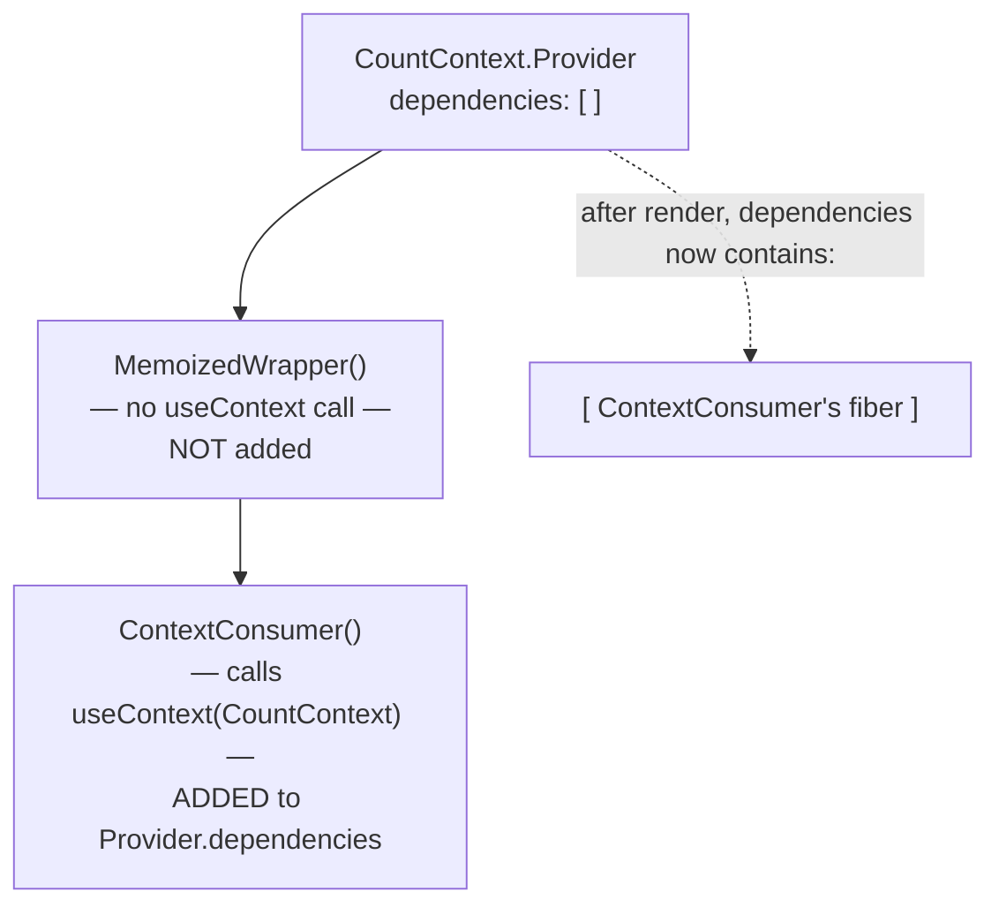
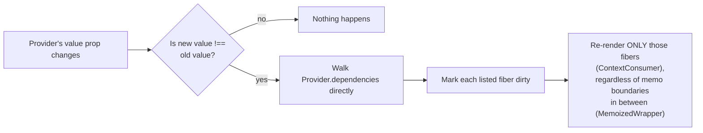
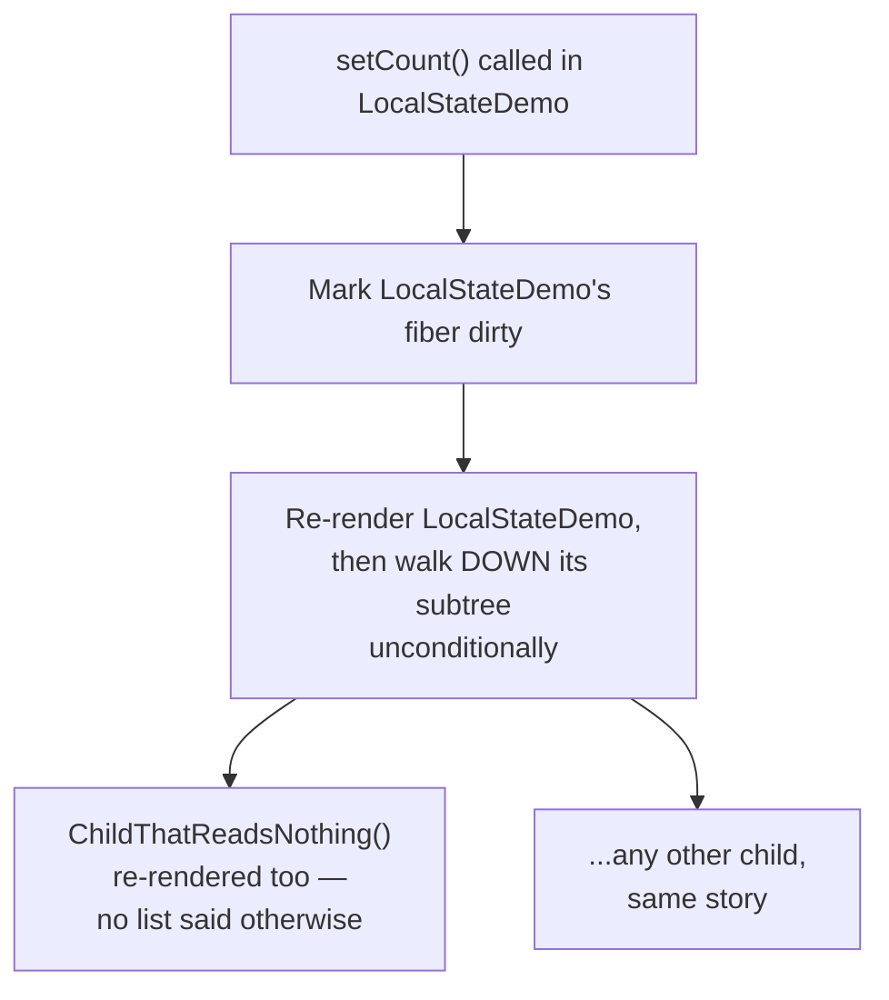

# How `useContext` Knows Who's Calling It

Companion write-up to [`RenderTriggerModel.tsx`](./RenderTriggerModel.tsx). That
file shows the *behavior* (context bypasses `React.memo`, local state doesn't
track readers). This file explains the *mechanism* underneath it: how does
`useContext(SomeContext)` know which component called it, when you never pass
the caller's identity as an argument?

The short answer: **React always knows "whose turn it is" while rendering,
and every hook just reads or writes against that ambient pointer.** You don't
pass the caller in — the caller is *implicit*, because `useContext` only ever
executes while React is in the middle of rendering that exact component.

---

## 1. Rendering is not "call every component function whenever." It's one at a time, with a pointer tracking which one.

React doesn't invoke component functions freely. Rendering a tree means
walking the fiber tree and, for each fiber, temporarily marking it as "the
one currently being rendered" before calling its function.

This is the whole trick: **`useContext` never receives an identity
parameter because it doesn't need one — it asks the ambient pointer "which
fiber is React currently rendering?" and that answer *is* the caller.**

This is also why hooks have the "only call at the top level, same order
every time" rule — a hook's identity within a component (which `useState`
slot it reads, which context it's tied to) is determined purely by *call
order during that fiber's render*, not by any explicit key you provide.

---

## 2. `useContext` walking up to find the Provider, then writing itself into its list

Nothing here is passed as a function argument from the component author's
side. `useContext(CountContext)` takes the *Context object* as its
parameter — that just says "which context am I reading" — but *who is
doing the reading* is inferred entirely from the ambient "currently
rendering" pointer at the moment the hook executes.

Compare this to `useState`: it works the same way. `useState(0)` doesn't
take a component ID either — React knows "this is the 3rd hook call during
FooComponent's render" because it's tracking the ambient fiber and a
call-order index inside it.

---

## 3. The Provider ends up holding a real subscriber list

After a full render pass through a subtree, the Provider fiber has
accumulated links to every fiber that called `useContext` on it — and
skipped every fiber that didn't:

This list is the actual, durable data structure React keeps — it's the
"yes" half of "no for local state, yes for context" from the original
explanation. It only exists because some fiber, during its own render,
explicitly called `useContext` on that Provider and got itself recorded.

---

## 4. Why this list lets React skip past `React.memo`

On the next commit, when the Provider's `value` changes identity, React
doesn't have to walk down the tree re-rendering everything to figure out
who cares. It already has the answer:

`React.memo` only ever intercepts the *normal, top-down, prop-diffing*
re-render path — "my parent re-rendered and is about to re-render me, but
my props are shallow-equal, so skip." A context update isn't that path at
all. React reaches `ContextConsumer` directly via the subscriber list, the
same way it would jump straight to a bookmark instead of re-reading a book
page by page. `MemoizedWrapper` in between is never even asked.

---

## 5. Contrast: local `useState` has no such list

There's no "who reads `count`" list anywhere. `count` is just a value
closed over in `LocalStateDemo`'s function scope. React's only obligation
is "re-render the fiber that owns this state, then its subtree by
default." `React.memo` is the *only* lever that can stop a child in that
subtree from re-rendering — by diffing props — because there is no
subscriber tracking to consult instead.

---

## Summary table

| | Local `useState` | `useContext` | External store (`useSyncExternalStore`) |
|---|---|---|---|
| Who tracks readers? | Nobody | The Provider fiber (`dependencies` list) | The store itself, outside React |
| How does a reader register? | N/A — there's no registration | Ambient "currently rendering fiber" pointer, captured the instant `useContext` runs | Explicit `store.subscribe(callback)` call, wired up by the hook |
| Can `React.memo` block it? | Yes — it's the only defense | No — React reaches the consumer directly | No — the store calls back only actual subscribers, memo is irrelevant |
| Where does "the caller" come from? | — | Implicit: whichever fiber React is mid-render on when the hook executes | Implicit at mount (the component that ran the hook), tracked explicitly by the store's own `Set`/list from then on |
